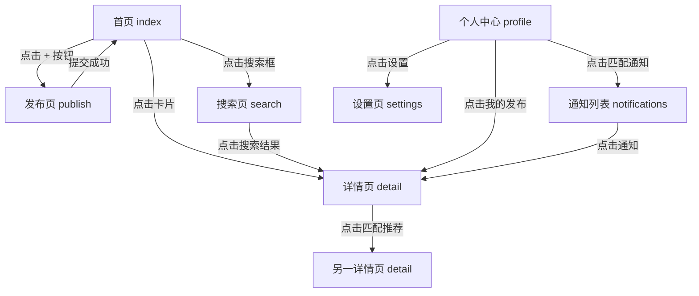

# 失物招领 APP — 页面结构图

## 页面导航架构

```
┌─────────────────────────────────────────────────────┐
│                   TabBar 底部导航                     │
├──────────────┬──────────────┬───────────────────────┤
│    首页      │    搜索      │      个人中心          │
│  (index)     │  (search)    │      (profile)         │
└──────────────┴──────────────┴───────────────────────┘
        │                            │
        ├── 详情页 (detail)          ├── 设置页 (settings)
        │                            │
        └── 发布页 (publish)         └── 匹配通知列表 (notifications)
```

---

## 页面清单

| 序号 | 页面路径 | 页面名称 | 类型 | 说明 |
|------|---------|---------|------|------|
| 1 | `/pages/index/index` | 首页 | TabBar | 搜索入口、失物/招领 Tab 切换、信息瀑布流列表、悬浮"+"发布按钮 |
| 2 | `/pages/search/search` | 搜索页 | TabBar | 搜索框、筛选面板（时间/地点/类型/发布类型）、结果列表、空状态 |
| 3 | `/pages/profile/profile` | 个人中心 | TabBar | 头像与基本信息、我的发布（分状态 Tab）、匹配通知列表、设置入口 |
| 4 | `/pages/publish/publish` | 发布页 | 普通 | 失物/招领共用表单，通过参数区分类型 |
| 5 | `/pages/detail/detail` | 详情页 | 普通 | 图片轮播、物品信息、发布者信息、联系方式、标记已找到 |
| 6 | `/pages/notifications/notifications` | 匹配通知列表 | 普通 | 匹配通知记录列表，点击跳转对应详情 |
| 7 | `/pages/settings/settings` | 设置页 | 普通 | 修改密码、关于我们、退出登录等 |

---

## 页面间跳转关系



---

## 各页面详细结构

### 1. 首页 (`/pages/index/index`)

```
┌────────────────────────────┐
│         搜索栏              │  ← 点击跳转搜索页
├────────────────────────────┤
│  [失物 Tab] [招领 Tab]     │  ← 切换数据源
├────────────────────────────┤
│                            │
│   信息卡片 1               │
│   ┌──────────────────┐    │
│   │ 图片 │ 物品名称   │    │
│   │      │ 地点·时间  │    │
│   │      │ 状态标签   │    │
│   └──────────────────┘    │
│                            │
│   信息卡片 2               │
│   ┌──────────────────┐    │
│   │ 图片 │ 物品名称   │    │
│   │      │ 地点·时间  │    │
│   │      │ 状态标签   │    │
│   └──────────────────┘    │
│                            │
│         ... 瀑布流 ...      │
│                            │
│                    ┌──┐   │
│                    │ +│   │  ← 悬浮发布按钮
│                    └──┘   │
└────────────────────────────┘
```

### 2. 搜索页 (`/pages/search/search`)

```
┌────────────────────────────┐
│  [搜索框]                  │
├────────────────────────────┤
│  筛选面板（可折叠）         │
│  时间: [今天/3天/7天/全部] │
│  地点: [下拉选择]          │
│  类型: [物品分类]          │
│  发布: [失物/招领/全部]    │
├────────────────────────────┤
│                            │
│   搜索结果列表              │
│   （结构与首页卡片一致）    │
│                            │
│   空状态：无匹配结果        │
│                            │
└────────────────────────────┘
```

### 3. 发布页 (`/pages/publish/publish`)

```
┌────────────────────────────┐
│  导航栏：[失物招领] [返回]  │
├────────────────────────────┤
│  发布类型：[失物] [招领]    │  ← 分段选择器
├────────────────────────────┤
│  物品名称：[___________]   │
│                            │
│  物品类型：[下拉选择  ▼]   │
│                            │
│  丢失/捡拾地点：[______]    │
│                            │
│  时间：[日期选择器]         │
│                            │
│  图片上传（最多 4 张）       │
│  ┌──┐ ┌──┐ ┌──┐ ┌──┐    │
│  │ +│ │  │ │  │ │  │    │
│  └──┘ └──┘ └──┘ └──┘    │
│                            │
│  联系方式：[___________]   │
│                            │
│  详细描述（选填）：         │
│  [____________________]   │
│                            │
│  [      提交发布      ]   │
└────────────────────────────┘
```

### 4. 详情页 (`/pages/detail/detail`)

```
┌────────────────────────────┐
│  导航栏：[详情] [返回]      │
├────────────────────────────┤
│                            │
│  ┌── 图片轮播区域 ──┐     │
│  │    [图1][图2]...  │     │
│  └──────────────────┘     │
│                            │
│  物品名称：华为手机         │
│  物品类型：电子产品         │
│  地点：图书馆二楼           │
│  时间：2026-06-15 14:30   │
│  状态：寻找中               │
│                            │
│  详细描述：                   │
│  黑色手机，蓝色手机壳...     │
│                            │
│  ─── 发布者信息 ───        │
│  发布者：张同学             │
│  联系方式：138****5678     │  ← 脱敏展示
│  [一键复制] [拨打电话]      │
│                            │
│  ─── 匹配推荐 ───         │  ← 仅匹配双方可见
│  以下信息可能与你相关：      │
│  招领卡片 1、招领卡片 2     │
│                            │
│  [      标记已找到     ]   │  ← 仅发布者可见
└────────────────────────────┘
```

### 5. 个人中心 (`/pages/profile/profile`)

```
┌────────────────────────────┐
│  头像  │  用户昵称          │
│        │  手机号            │
├────────────────────────────┤
│  [寻找中] [已找到] [已关闭]  │  ← 状态 Tab
├────────────────────────────┤
│                            │
│   我的失物列表              │
│   ┌──────────────────┐    │
│   │ 失物卡片 1        │    │
│   └──────────────────┘    │
│   ┌──────────────────┐    │
│   │ 失物卡片 2        │    │
│   └──────────────────┘    │
│                            │
│   我的招领列表              │
│   ┌──────────────────┐    │
│   │ 招领卡片 1        │    │
│   └──────────────────┘    │
│                            │
├────────────────────────────┤
│  > 匹配通知          [3]   │  ← 红点提示
│  > 设置                    │
└────────────────────────────┘
```

### 6. 匹配通知列表 (`/pages/notifications/notifications`)

```
┌────────────────────────────┐
│  导航栏：[通知列表] [返回]   │
├────────────────────────────┤
│                            │
│  通知 1                    │
│  ┌──────────────────┐    │
│  │ 系统提示          │    │
│  │ 你的"华为手机"失物│    │
│  │ 与张三的招领信息   │    │
│  │ 高度匹配          │    │
│  │          14:30    │    │
│  └──────────────────┘    │
│                            │
│  通知 2                    │
│  ┌──────────────────┐    │
│  │ 系统提示          │    │
│  │ ...              │    │
│  └──────────────────┘    │
│                            │
│  空状态：暂无通知           │
└────────────────────────────┘
```

### 7. 设置页 (`/pages/settings/settings`)

```
┌────────────────────────────┐
│  导航栏：[设置] [返回]      │
├────────────────────────────┤
│  > 修改密码                │
│  > 关于我们                │
├────────────────────────────┤
│  [      退出登录      ]   │
└────────────────────────────┘
```
